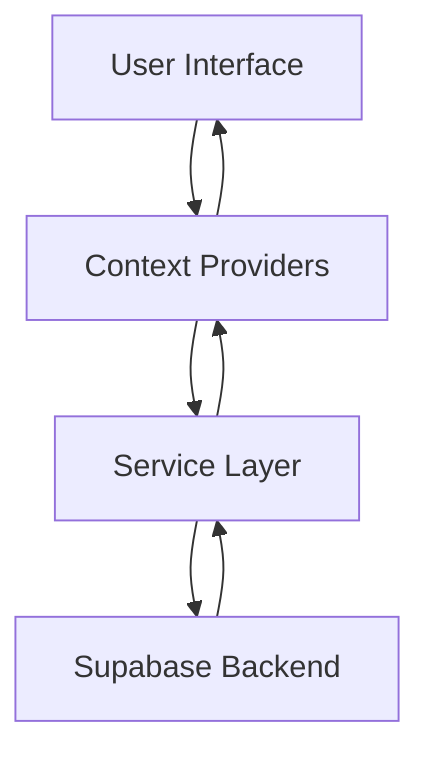

# Timetable Scheduling System

A modern web application built with Vite, React, and TypeScript for managing and scheduling timetables efficiently.

## Features

- User Authentication
- Dashboard Overview
- Batch Management
- Faculty Management
- Subject Management
- Room Management
- Timetable Generation and Viewing
- Constraint Management
- Approval System
- Reports Generation

## Tech Stack

- **Frontend Framework:** React 18 with TypeScript
- **Build Tool:** Vite
- **Styling:** Tailwind CSS
- **Backend/Database:** Supabase
- **Routing:** React Router
- **Icons:** Lucide React
- **Type Checking:** TypeScript
- **Code Quality:** ESLint

## Prerequisites

- Node.js (Latest LTS version recommended)
- npm or yarn

## Installation

1. Clone the repository:
```bash
git clone https://github.com/HeyAman63/SIH-Project.git
cd SIH-Project
```

2. Install dependencies:
```bash
npm install
# or
yarn install
```

3. Set up environment variables:
Create a `.env` file in the root directory and add necessary environment variables for Supabase configuration.

## Available Scripts

- `npm run dev` - Start the development server
- `npm run build` - Build for production
- `npm run preview` - Preview production build
- `npm run lint` - Run ESLint for code quality

## Architecture

### Overview
The Timetable Scheduling System follows a modern React application architecture with a clear separation of concerns and state management through React Context. The application interfaces with Supabase for backend services and real-time data synchronization.

### Architectural Layers

1. **Presentation Layer**
   - React Components (UI Elements)
   - Pages (Route Components)
   - Styling (Tailwind CSS)

2. **State Management Layer**
   - AuthContext: Manages authentication state and user sessions
   - DataContext: Handles application-wide data management
   - Local Component State: For component-specific UI states

3. **Data Access Layer**
   - Supabase Client: Handles database operations and real-time subscriptions
   - API Integration: Manages all backend communications
   - Data Transformations: Converts raw data to application models

4. **Business Logic Layer**
   - Timetable Generation Algorithm
   - Constraint Validation
   - Schedule Optimization
   - Approval Workflow

### Data Flow



### Component Architecture

```
src/
├── components/       # Reusable UI components
│   ├── Layout.tsx   # Main layout wrapper
│   ├── Modal.tsx    # Reusable modal component
│   ├── Navbar.tsx   # Top navigation bar
│   ├── Sidebar.tsx  # Side navigation menu
│   └── TableView.tsx # Data table component
├── context/         # React Context providers
│   ├── AuthContext.tsx  # Authentication state management
│   └── DataContext.tsx  # Global data state management
├── pages/          # Application pages/routes
│   ├── ApprovalPage.tsx    # Approval workflow
│   ├── BatchPage.tsx       # Batch management
│   ├── ConstraintsPage.tsx # Scheduling constraints
│   ├── Dashboard.tsx       # Main dashboard
│   ├── FacultyPage.tsx     # Faculty management
│   ├── LoginPage.tsx       # Authentication
│   ├── ReportsPage.tsx     # Report generation
│   ├── RoomsPage.tsx       # Room management
│   ├── SchedulerPage.tsx   # Timetable scheduler
│   └── SubjectsPage.tsx    # Subject management
└── main.tsx        # Application entry point
```

### Key Technical Decisions

1. **Supabase Integration**
   - Real-time database updates
   - Built-in authentication
   - Row-level security
   - Scalable data storage

2. **React Context**
   - Centralized state management
   - Reduced prop drilling
   - Simplified data flow

3. **TypeScript**
   - Type safety
   - Better developer experience
   - Reduced runtime errors

4. **Vite**
   - Fast development server
   - Optimized build process
   - Modern development experience

## Contributing

1. Fork the repository
2. Create your feature branch: `git checkout -b feature/YourFeature`
3. Commit your changes: `git commit -m 'Add some feature'`
4. Push to the branch: `git push origin feature/YourFeature`
5. Open a pull request

## License

[MIT License](LICENSE)

## Authors

- [HeyAman63](https://github.com/HeyAman63)